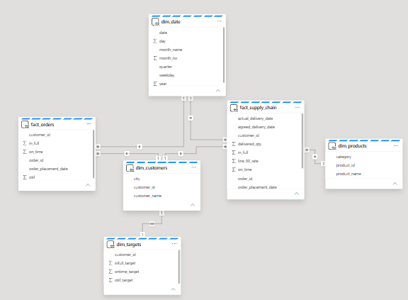
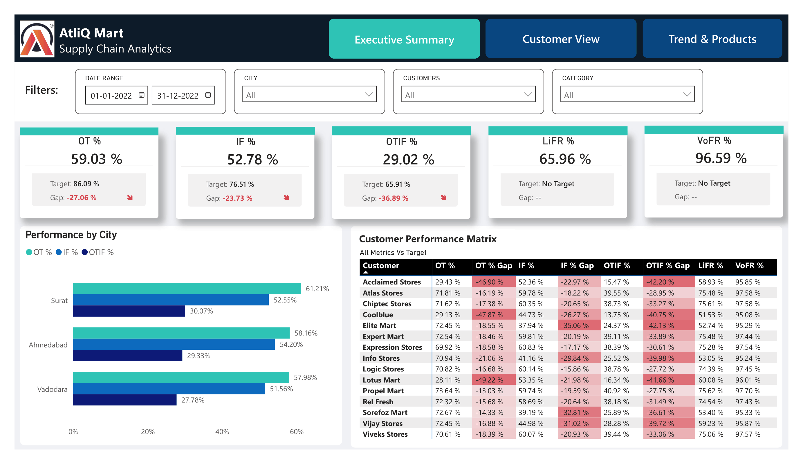
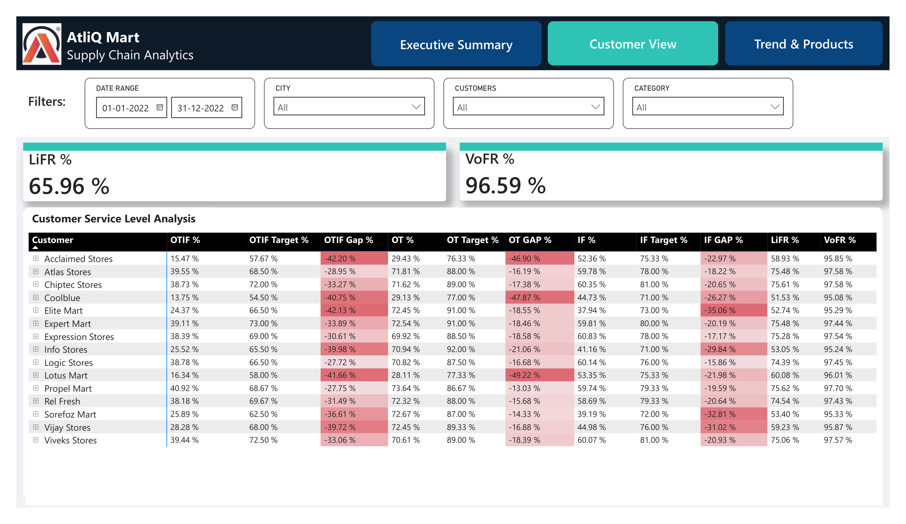
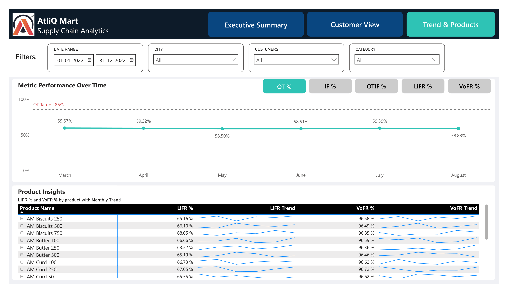
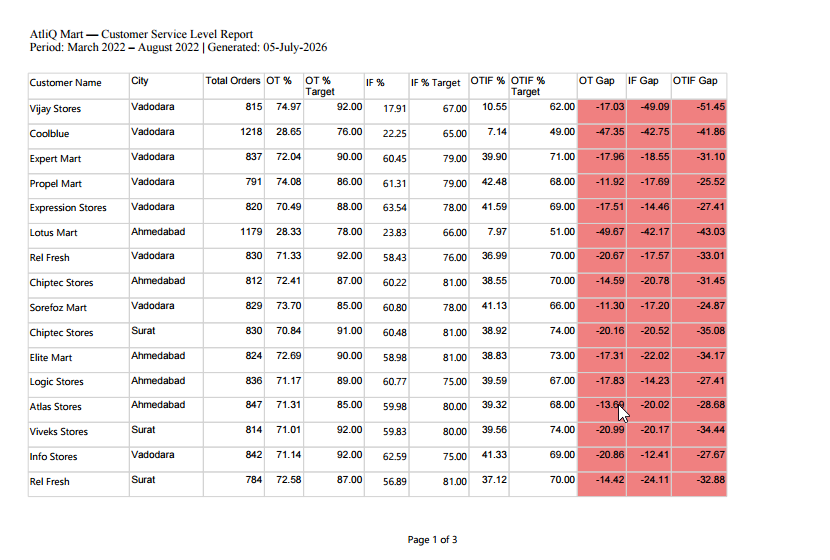

# AtliQ Mart — Supply Chain Analytics

**End-to-end BI + Data Engineering project on Microsoft Fabric**


---

## What this project is about

AtliQ Mart is an FMCG manufacturer operating across Surat, Ahmedabad, and Vadodara. They were losing key customers at contract renewal time — and nobody could explain why because service level tracking simply didn't exist.

The ask was straightforward: build something that tells management, at a glance, whether orders are reaching customers on time and in full.

This project covers the full pipeline — raw CSV files in, clean KPI dashboards out — built entirely on Microsoft Fabric.

---

## Architecture



Data flows through three layers on OneLake:

```
GitHub (CSV files)
    → Fabric Data Pipeline (ForEach activity)
        → Bronze Lakehouse (raw Delta tables)
            → Silver Lakehouse (PySpark notebooks — cleaning + transformation)
                → Gold Lakehouse (PySpark notebooks — business logic)
                    → Fabric Warehouse (6 Delta tables copied via pipeline)
                        → DirectLake Semantic Model
                            → Power BI Report (Live Connection)
```

The reason for separating the Gold Lakehouse from the Fabric Warehouse is intentional — the Warehouse exposes a SQL endpoint, which makes it straightforward to connect Report Builder for the paginated report and run ad hoc queries independently of Power BI.

---

## Tech Stack

| Layer | Tool |
|---|---|
| Ingestion | Fabric Data Pipeline (ForEach + Copy activity) |
| Bronze | Fabric Lakehouse — raw Delta tables |
| Silver | PySpark Notebooks — cleaning, type casting, derived flags |
| Gold | PySpark Notebooks → Fabric Warehouse (6 Delta tables) |
| Semantic Layer | DirectLake Semantic Model (SQL Direct Mode) |
| Reporting | Power BI Report — Live Connection to Semantic Model |
| Paginated Report | Power BI Report Builder |
| Version Control | GitHub |

---

## Data Model

Star schema — two fact tables sharing the same dimension tables (Constellation schema).

```
dim_date ──────────────────────────────────────────┐
                                                   │
dim_customers ──── fact_supply_chain (57,096 rows) ├── dim_products
       │                                           │
       └────────── fact_orders (31,729 rows)       │
       │
       └────────── dim_targets (customer-level OT/IF/OTIF targets)
```

The split between `fact_supply_chain` (order line level) and `fact_orders` (order level) matters because OT%, IF%, OTIF% are measured at the order level, while LiFR% and VoFR% are measured at the line level. Mixing them in one fact table would produce wrong aggregations.

---

## Pipeline Details

**Bronze** — 6 CSV files copied from GitHub repo into Fabric Lakehouse Files via ForEach pipeline activity. Converted to Delta tables.

**Silver** — PySpark notebooks handle cleaning per table: date parsing, whitespace trimming, type casting, and deriving `on_time`, `in_full`, `otif` flags from the raw columns. All loads use overwrite mode (idempotent).

**Gold** — PySpark notebooks apply business logic and produce the final 6 tables. These are then copied into Fabric Warehouse (`gold_layer` schema) via pipeline. The Warehouse copy is what powers the Semantic Model and paginated report.

```sql
-- Example Gold table: fact_supply_chain
-- Columns: order_id, customer_id, product_id, order_qty, delivered_qty,
--          order_placement_date, agreed_delivery_date, actual_delivery_date,
--          on_time, in_full, otif, line_fill_rate
```

**Orchestration** — Single Data Pipeline runs the full sequence: ForEach copy → Bronze notebooks → Silver notebooks → Gold notebooks → Warehouse copy activities.

---

## DAX Measures

13 measures in a dedicated `_Measures` table. The key ones:

```
-- Order level (fact_orders)
OT %    = DIVIDE(CALCULATE(COUNTROWS(fact_orders), fact_orders[on_time]=1), [Total Orders])
IF %    = DIVIDE(CALCULATE(COUNTROWS(fact_orders), fact_orders[in_full]=1), [Total Orders])
OTIF %  = DIVIDE(CALCULATE(COUNTROWS(fact_orders), fact_orders[otif]=1), [Total Orders])

-- Line level (fact_supply_chain)
LiFR %  = DIVIDE(CALCULATE(COUNTROWS(fact_supply_chain), fact_supply_chain[in_full]=1), [Total Order Lines])
VoFR %  = DIVIDE(SUM(fact_supply_chain[delivered_qty]), SUM(fact_supply_chain[order_qty]))

-- Targets (AVERAGEX over dim_targets per customer context)
OT Target %    = AVERAGEX(dim_targets, dim_targets[ontime_target])
IF Target %    = AVERAGEX(dim_targets, dim_targets[infull_target])
OTIF Target %  = AVERAGEX(dim_targets, dim_targets[otif_target])
```

---

## Report Pages



**Page 1 — Executive Summary**
KPI cards (actual, target, gap) for all five metrics. Performance by city as a clustered bar chart. Customer performance matrix with conditional formatting on gap columns.



**Page 2 — Customer View**
Full breakdown by customer and city — OTIF%, OT%, IF%, LiFR%, VoFR% with targets and gaps. Expandable rows for city-level drill-down.



**Page 3 — Trend & Products**
Line chart with a field parameter switcher (OT%/IF%/OTIF%/LiFR%/VoFR%) and dashed target reference line. Drillable from month → week → day. Product matrix with LiFR% and VoFR% per SKU plus sparkline trend columns.

---

## Paginated Report



Built in Power BI Report Builder, connected live to the Fabric Warehouse SQL endpoint.

Covers all 15 customers across all three cities — OT%, IF%, OTIF% with targets and gaps per customer. Gap columns are conditionally formatted red/green. Designed for PDF export and management distribution, not interactive use.

---

## Key Findings

Overall performance is significantly below target across all three cities — this is a systemic issue, not isolated to one location.

| Metric | Actual | Target | Gap |
|---|---|---|---|
| OT % | 59.03% | 86.09% | -27.06% |
| IF % | 52.78% | 76.51% | -23.73% |
| OTIF % | 29.02% | 65.91% | -36.89% |
| LiFR % | 65.96% | — | — |
| VoFR % | 96.59% | — | — |

A few things stand out from the data:

- VoFR at 96.59% tells you total volume capacity isn't the problem — goods are being shipped. The failure is in timing and line-level completeness.
- Coolblue, Acclaimed Stores, and Lotus Mart have OTIF in the 13–16% range — both OT and IF failing together, which points to deeper fulfilment issues with those accounts specifically.
- LiFR at 66% means roughly 1 in 3 order lines isn't delivered in full, suggesting SKU-level inventory or demand forecasting gaps rather than a capacity problem.

---

## Repository Structure

```
atliq-sc-analytics/
├── sql/
│   └── gold/
│       ├── tables/
│       ├── stored_procedures/
│       └── views/
├── screenshots/
│   ├── rchitecture_diagram.png
│   ├── page1_executive_summary.png
│   ├── page2_customer_view.png
│   ├── page3_trend_products.png
│   └── paginated_report_preview.png
├── docs/
│   ├── business_knowledge.pdf
│   └── metrics_definitions.md
└── README.md
```

---

## Skills Demonstrated

**Data Engineering** — Medallion architecture on Microsoft Fabric, PySpark transformations, Fabric Warehouse with Delta tables, idempotent load patterns, pipeline orchestration with ForEach and Copy activities, DirectLake semantic model.

**Business Intelligence** — Constellation schema design, DAX measure development, field parameters for dynamic metric switching, conditional formatting, sparkline trends, paginated reports via Report Builder.

**Domain** — FMCG supply chain KPIs, order vs order line metric distinction, customer-level target tracking.

---

## About

Built as part of the CodeBasics Resume Project Challenge (FMCG | C2), with the pipeline rebuilt on Microsoft Fabric using PySpark and Data Pipelines instead of the standard PostgreSQL approach.

**Hemant Mandge** — BI & Data Engineer
[LinkedIn](https://linkedin.com/in/hemantmandge) | [GitHub](https://github.com/hemantmandge)

Dataset and business context: [CodeBasics](https://codebasics.io)